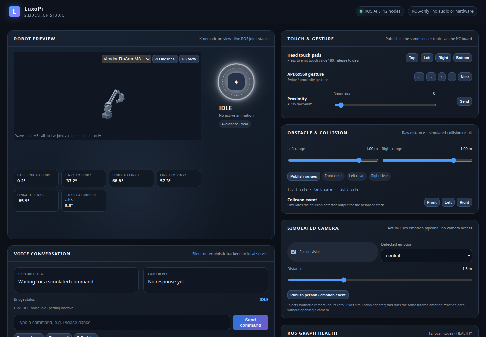

# LuxoPi ROS2 Project


A ROS2-based control system for the RoArm-M3 robotic arm with Luxo Jr-style animated behaviors, featuring emotion detection, collision avoidance, and interactive capabilities.



## Hardware-free development

The modernized ROS Jazzy simulator runs the real behavior graph and defaults to the six-axis vendor M3 model in an isolated container. From this checkout, run `scripts/simulator.sh up -d --build`, then open http://127.0.0.1:8080 or http://100.69.210.33:8080 on the tailnet. The helper also works by absolute path from another directory or an SSH session. No physical audio, camera, serial, or LED devices are mounted.

See [simulator launch and SSH access](docs/simulator-launch.md), [behavior ownership and future Home Assistant boundary](docs/behavior-architecture.md), and [feature evidence](docs/feature-coverage.md). The optional [MuJoCo physics and virtual sensor fixture](docs/virtual-obstacle-sensors.md) exercises the vendor inertias and end-effector sensor rays. All 38 animations are retained, including listening/thinking/speaking cues. Local speech-model overlays are optional; the default conversation backend is explicitly simulated. The physical installation instructions below describe the historical hardware path and are separate from the container simulator.

## Table of Contents
- [Overview](#overview)
- [System Requirements](#system-requirements)
- [Installation](#installation)
- [Quick Start](#quick-start)
- [Launch Options](#launch-options)
- [Features](#features)
  - [Animation System](#animation-system)
  - [Camera Interaction](#camera-interaction)
  - [Collision Detection](#collision-detection)
  - [Dynamic Adaptation](#dynamic-adaptation)
- [Development](#development)
- [Autostart Service](#autostart-service)
- [Troubleshooting](#troubleshooting)
- [API Reference](#api-reference)

## Overview

LuxoPi transforms a RoArm-M3 robotic arm into an interactive desk lamp character with personality. The system combines:

- **Hardware Control**: Direct serial communication with RoArm-M3
- **Animation Engine**: Disney-inspired animation principles for lifelike movement
- **Vision System**: Emotion detection and person tracking using OAK-D camera
- **Safety Features**: Multi-sensor collision detection and avoidance
- **Interactive Modes**: Physical teaching through dynamic force adaptation

### Package Structure
- `roarm`: Core robot definitions (URDF, visualization)
- `luxo_behaviors`: Animation, vision, collision avoidance, and hardware interface
- `serial_ctrl`: Low-level serial communication

## System Requirements

### Hardware
- **Computer**: Raspberry Pi 5 (4GB+ RAM)
- **Robot**: RoArm-M3 connected via serial (`/dev/ttyAMA0`)
- **Camera** (optional): OAK-D for vision features
- **Sensors** (optional): APDS9960 proximity sensor, VL53L4CD distance sensors

### Software
- **OS**: Ubuntu 24.04
- **ROS2**: Jazzy
- **Python**: 3.12 (Ubuntu 24.04 development and simulator target)

## Installation

### 1. Clone Repository
```bash
cd ~
git clone https://github.com/NickEngmann/luxopi-ros.git
cd luxopi-ros
```

### 2. Install System Dependencies
```bash
# ROS2 packages
sudo apt update
sudo apt install -y \
    ros-jazzy-joint-state-publisher \
    ros-jazzy-robot-state-publisher \
    ros-jazzy-rviz2 \
    ros-jazzy-xacro
sudo bash ./INSTALL.sh

# Python packages
pip3 install -r requirements.txt --break-system-packages
```

### 3. Install Optional Dependencies

**For Camera Features:**
```bash
# DepthAI for OAK-D camera
pip3 install depthai opencv-python blobconverter --break-system-packages
```

**For Hardware Sensors:**
```bash
# I2C sensor libraries
pip3 install adafruit-circuitpython-apds9960 adafruit-circuitpython-vl53l4cd --break-system-packages
```

### 4. Build Workspace
```bash
colcon build
source install/setup.bash
```

### 5. Set Permissions
```bash
# Serial port access
sudo chmod 777 /dev/ttyAMA0

# Add user to dialout group for serial access
sudo usermod -aG dialout $USER
```

# Camera access (if using OAK-D)
sudo usermod -aG plugdev $USER
sudo udevadm control --reload-rules && sudo udevadm trigger
```

## Quick Start

### Basic Hardware Control
```bash
# Launch with hardware only
ros2 launch luxo_behaviors luxo_system.launch.py use_hardware:=true
```

### Simulation Mode
```bash
# Kinematic ROS simulation (no physical device, microphone, or camera required)
ros2 launch luxo_behaviors luxo_system.launch.py
```

In simulation mode the browser control panel is enabled by default at
`http://localhost:8080` (`enable_simulator_dashboard:=false` disables it). The
panel injects bounded synthetic voice, direction, touch, gesture, proximity,
distance, vision, and collision inputs and displays the live state, response,
joint positions, and sensor outputs. Run the container with a loopback-only
port mapping such as `-p 127.0.0.1:8080:8080` when opening it from the host.

Simulation publishes one rate-limited `/joint_states` stream from the shared
animation target topic and the checked-in four-joint URDF. It provides ROS joint
states and TF, not Gazebo physics or contact simulation: the URDF currently has
visual meshes without collision or inertial data. Do not treat simulated
collisions as physical stopping-distance evidence. Live microphones and the OAK
camera are hardware-only launch paths; simulation voice direction enters through
`/sim/audio_direction` and uses the same estimator as the live direction node.
The text-only speech bridge defaults to a deterministic simulation backend and
does not play audio. Hardware speech is opt-in with `enable_speech_bridge:=true`
and `speech_backend:=local` plus a configured JSON argv service command.
The simulation also runs the ROS-only collision classifier against injected
sensor topics (`enable_sim_sensors:=false` disables it); no I2C or camera
drivers are started in simulation. Collision warnings and safety FSM states
hold simulated motion output. This is a software integration check, not a
physical collision-response or stopping-distance validation.

### Full System with All Features
```bash
# Hardware + Camera + Collision Detection
ros2 launch luxo_behaviors luxo_system.launch.py \
    use_hardware:=true \
    use_camera:=true \
    sense_collision:=true \
    enable_dynamic_adaptation:=true
```

## Launch Options

| Parameter | Default | Description |
|-----------|---------|-------------|
| `use_hardware` | `false` | Connect to physical robot arm |
| `use_camera` | `auto`* | Enable OAK-D camera features |
| `enable_emotion_detection` | `auto`* | React to detected emotions |
| `sense_collision` | `auto`* | Enable proximity sensors |
| `enable_depth_collision` | `false` | Use camera depth for collision |
| `enable_dynamic_adaptation` | `auto`* | Allow physical positioning |
| `run_demo` | `false` | Run automated demo sequence |
| `use_gui` | `false` | Show joint state GUI |
| `test_mode` | `animation` | `animation` or `position` test |
| `safety_distance` | `0.3` | Collision threshold (meters) |
| `verbose` | `false` | Enable debug output |
| `camera_rotation` | `false` | Rotate camera 180° if mounted upside-down |

*`auto` = enabled in hardware mode, disabled in simulation

## Features

### Animation System

The robot performs lifelike animations using Disney animation principles.

#### Available Animations
- **Emotions**: `excited`, `sad`, `playful`, `startled`
- **Actions**: `curious`, `think`, `stretch`, `dance`
- **Responses**: `nod`, `shake`
- **Control**: `idle`, `stop`, `close`

#### Triggering Animations
```bash
# Basic animation
ros2 topic pub --once /roarm/animation_command std_msgs/String "data: curious"

# With speed control (0.5 = half speed, 2.0 = double speed)
ros2 topic pub --once /roarm/animation_command std_msgs/String "data: excited 1.5"
```

#### Animation Topics
- `/roarm/animation_command` - Send animation commands
- `/joint_states` - Current joint positions
- `/joint_states_target` - Target joint positions

#### Action Goal Preemption
The `play_animation` action serializes animation execution. Accepting a newer
goal requests cancellation of the previous goal, and cancellation is tracked
per goal so the newer request cannot clear the older request's stop signal.
Interpolation checks cancellation on each update (about every 10 ms) and stops
publishing later target positions. This stops ROS-side trajectory updates; it
does not claim to provide an immediate motor brake on the RoArm firmware.

The cancellation tracker is ROS-independent and can be regression-tested
without hardware:

```bash
cd src/luxo_behaviors
python -m pytest -q tests/test_motion_control.py
```

### Camera Interaction

Real-time emotion detection triggers corresponding animations.

#### Emotion Mappings
| Detected Emotion | Triggered Animations |
|------------------|---------------------|
| Happy | excited, playful, dance |
| Sad | sad, droop |
| Surprised | startled, curious |
| Angry | shake, think, startled |
| Neutral | idle, curious, stretch, nod |

#### Camera Topics
- `/camera/emotion` - Detected emotion
- `/camera/person_distance` - Distance to person (meters)
- `/camera/image_raw` - Camera feed (if enabled)

### Collision Detection

Multi-layer safety system prevents collisions.

#### Detection Methods
1. **Proximity Sensor** (APDS9960) - Front detection
2. **Distance Sensors** (VL53L4CD) - Side detection
3. **Depth Camera** - 3D obstacle mapping

#### Collision Behaviors
1. **Warning Zone** - Slow down movements
2. **Danger Zone** - Stop and redirect
3. **Persistent Obstacle** - Execute escape maneuvers
4. **Extended Collision** - Return to home position

#### Collision Topics
- `/head_collision_warning` - Front collision status
- `/left_collision_warning` - Left side status
- `/right_collision_warning` - Right side status
- `/collision_details` - Detailed collision info

### Dynamic Adaptation

Allows manual positioning by reducing servo torque.

#### Enable/Disable
```bash
# Enable via command line
ros2 topic pub --once /dynamic_adaptation_toggle std_msgs/Bool "data: true"

# Disable
ros2 topic pub --once /dynamic_adaptation_toggle std_msgs/Bool "data: false"
```

#### Use Cases
- Teaching new positions by hand
- Recovery from stuck positions
- Interactive demonstrations
- Fine-tuning movements

## Development

### Project Structure
```
luxopi-ros/
├── src/
│   ├── roarm/              # URDF and visualization
│   ├── luxo_behaviors/     # Main behavior package
│   │   ├── animation_command.py
│   │   ├── camera_interaction.py
│   │   ├── collision_detection.py
│   │   ├── hardware_interface.py
│   │   └── ...
│   └── serial_ctrl/        # Serial communication
├── launch/
├── config/
└── docs/
```

### Adding New Animations

1. Edit `animation_command.py`:
```python
def your_new_animation(self):
    """Description of your animation."""
    keyframes = [
        [base, shoulder, elbow, wrist, hand],  # Keyframe 1
        [base, shoulder, elbow, wrist, hand],  # Keyframe 2
        # ... more keyframes
    ]
    durations = [0.5, 0.8, ...]  # Duration for each transition
    self.start_animation(keyframes, durations)
```

2. Register in `command_callback`:
```python
animations = {
    # ... existing animations
    'your_animation': self.your_new_animation,
}
```

3. Build and test:
```bash
colcon build --packages-select luxo_behaviors
source install/setup.bash
ros2 topic pub --once /roarm/animation_command std_msgs/String "data: your_animation"
```

### Monitoring System

```bash
# List active nodes
ros2 node list

# View topics
ros2 topic list

# Monitor specific topic
ros2 topic echo /joint_states

# Check node info
ros2 node info /animation_command

# View service calls
ros2 service list
```

## Autostart Service

Configure the system to start automatically at boot.

### Setup
```bash
# Copy service file
sudo cp luxopi-ros.service /etc/systemd/system/

# Make startup script executable
chmod +x /home/pi/luxopi-ros/start_luxopi.sh

# Enable service
sudo systemctl daemon-reload
sudo systemctl enable luxopi-ros.service
sudo systemctl start luxopi-ros.service
```

### Management
```bash
# Check status
sudo systemctl status luxopi-ros

# View logs
journalctl -u luxopi-ros -f

# Restart
sudo systemctl restart luxopi-ros

# Disable autostart
sudo systemctl disable luxopi-ros
```

## Troubleshooting

### Common Issues

**Serial Connection Failed**
```bash
# Check permissions
sudo chmod 777 /dev/ttyAMA0

# Verify device exists
ls -l /dev/tty*

# Test serial connection
screen /dev/ttyAMA0 115200
```

**Camera Not Detected**
```bash
# Check USB connection
lsusb | grep Luxonis

# Reset USB
sudo usbreset 03e7:f63b

# Check permissions
groups $USER  # Should include 'plugdev'
```

**Animation Jitter**
```bash
# Kill duplicate processes
pkill -f animation_command
pkill -f robot_state_publisher

# Restart system
ros2 launch luxo_behaviors luxo_system.launch.py use_hardware:=true
```

**Joint Limits Exceeded**
- Check URDF joint limits in `roarm/urdf/roarm.urdf`
- Verify commanded positions are within valid ranges
- Use `enforce_joint_limits:=true` parameter

### Debug Mode
```bash
# Enable verbose output
ros2 launch luxo_behaviors luxo_system.launch.py use_hardware:=true verbose:=true

# Monitor all topics
ros2 topic echo /joint_states
ros2 topic echo /collision_warning
ros2 topic echo /camera/emotion
```

### WSL2 Development
```bash
# Attach Luxonis devices
usbipd attach --wsl Ubuntu-24.04 --hardware-id "03e7:f63c" --auto-attach
usbipd attach --wsl Ubuntu-24.04 --hardware-id "03e7:f63b" --auto-attach
```

## API Reference

For detailed robot arm commands and JSON API documentation, see [ROBOT_ARM_API.md](ROBOT_ARM_API.md).

## Contributing

Please read [CONTRIBUTING.md](CONTRIBUTING.md) for our code of conduct and submission process.

## License

This project is licensed under the MIT License - see [LICENSE](LICENSE) for details.

### Camera Pipeline Checks

The camera node uses one-slot, non-blocking DepthAI queues for color and
detection frames, plus a bounded 256-message queue for per-face recognition
outputs. The host drains all pending recognition messages each processing tick;
the synchronizer caps incomplete frame sequences at 16 and evicts the oldest
sequence. Emotion work is a one-frame latest-only queue. Framebuffer updates
wait on the shutdown event instead of polling continuously, and retry callbacks
do not sleep after reconnecting.

The buffering and sequence-sync behavior has hardware-free tests:

```bash
pytest src/luxo_behaviors/test/test_camera_buffering.py
```

`dev/emotional_camera_api.py` follows the same latest-frame policy. A real OAK
camera is still needed to validate DepthAI model throughput and image quality.

## Running Tests

```bash
pytest
```

### Test Framework
- **Framework**: ament (ROS2 testing framework)
- **Test files**: Located in `src/luxo_behaviors/test/`
- **Test types**: flake8 (code style), copyright (license headers), pep257 (docstrings)
- **Run all tests**: `colcon test` or `pytest`
- **Run specific test**: `colcon test --packages-select luxo_behaviors`

## Build & Run

### Build System
- **Language**: Python 3.x, C++ (ROS2 packages)
- **Framework**: ROS2 Humble
- **Build tool**: colcon
- **Docker image**: ros:humble-ros-base

### Installation
```bash
# Source ROS2 environment
source /opt/ros/humble/setup.bash

# Install Python dependencies
pip install -r requirements.txt

# Build ROS2 packages
colcon build --symlink-install
```

### Running the Project
```bash
# Source the workspace
source install/setup.bash

# Run a specific node
ros2 run <package_name> <node_name>

# Example: Run behaviors
ros2 run luxo_behaviors behaviors_node
```

### Hardware Requirements
- RoArm-M3 robotic arm
- DepthAI camera module (for vision)
- Serial connection for arm control
- SMBus for sensor communication

## Dependencies

### Python Packages
- depthai==2.30.0
- depthai-sdk==1.15.1
- customtkinter==5.2.0
- pyserial==3.5
- smbus
- blobconverter
- certifi==2023.7.22
- charset-normalizer==3.2.0
- idna==3.4
- requests==2.31.0
- urllib3==2.0.4

### ROS2 Packages
- rclpy
- std_msgs
- geometry_msgs
- sensor_msgs
- nav_msgs
- tf2
- tf2_ros
- action_msgs
- rclpy_action

## Testing

### Test Commands
```bash
# Run all tests
pytest

# Run with verbose output
pytest -v

# Run specific test file
pytest src/luxo_behaviors/test/test_flake8.py

# Run colcon tests
colcon test
```

### Test Coverage
- Code style: flake8
- Copyright headers: ament_copyright
- Docstrings: ament_pep257
- Functional tests: pytest with ROS2 mocking

### Hardware Mocks
- **Required**: No (software tests use mocks)
- **Simulation**: Headless ROS kinematic target/URDF pipeline; Gazebo dynamics and contact physics are not included
- **Mock objects**: Used for depthai camera, serial port, and arm control

## Known Issues

- No critical issues in current pipeline runs
- Run the documented pytest suites for current offline and native ROS evidence
- Hardware-dependent tests require actual RoArm-M3 setup

## Notes

### Architecture
- Modular ROS2 package structure
- Behavior-driven animation system
- Vision-based collision avoidance
- CustomTkinter GUI for control

### Important Files
- `src/luxo_behaviors/` - Main behavior package
- `requirements.txt` - Python dependencies
- `.github/workflows/test.yml` - CI test configuration
- `setup.py` - ROS2 package configuration

### Development Workflow
1. Clone repository
2. Source ROS2 environment
3. Install dependencies
4. Build with colcon
5. Run tests
6. Test with hardware or simulation

### Contributing
See [CONTRIBUTING.md](CONTRIBUTING.md) for code of conduct and submission process.

## License

This project is licensed under the MIT License - see [LICENSE](LICENSE) for details.
